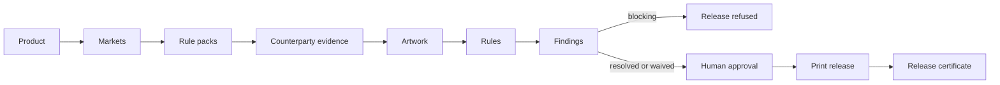

# PackAuth™

### Approve packaging before it is printed, shipped, sold, or changed.

**Packaging lifecycle compliance infrastructure.**

---

A missing Arabic label block is a rejected container at the port. A missing
allergen is a recall. Both are decided long before anyone notices — at artwork
stage, in an email thread, against a spreadsheet nobody has version-controlled.

PackAuth is the authority layer for that moment. It holds the manifest, runs the
rules, gathers the counterparty evidence, records who approved what for which
market, and issues a release certificate a printer can act on and an auditor can
verify later.



## Three things it will not do

**It will not pass a market it does not cover.** 0 markets are
enforced and 0 are registered but unwritten. A registered
market returns `not covered`. It never returns a pass, because a compliance
product that lies by omission is worse than no product.

**It will not treat an unrun check as a passed check.** A rule that cannot
execute because an input is missing returns `insufficient_input` and blocks,
naming what is missing. Silence is never success.

**It will not let an approval widen itself.** *Approved for UK and EU, excluded
for Saudi Arabia* is a normal, first-class outcome, and the exclusion travels
onto the release certificate.

## By the numbers

| | |
|---|---|
| Lifecycle | 24 states, 39 legal transitions |
| Rule packs | 23 enforced, 0 executable rules |
| Markets | 0 enforced, 0 registered |
| API | 78 operations, 6 public |

## Build against it

| | |
|---|---|
| **[API reference](https://packauth.com/api)** | Every endpoint, its route, the scope it needs |
| **[OpenAPI 3.1](https://packauth.com/openapi.json)** | Generate a client in any language |
| **[packauth-js](https://github.com/PackAuth/packauth-js)** | JavaScript client and CLI · Apache-2.0 |
| **[packauth-python](https://github.com/PackAuth/packauth-python)** | Python client, standard library only · Apache-2.0 |

```bash
curl https://api.packauth.com/v1/manifests \
  -H "Authorization: Bearer $PACKAUTH_TOKEN"
```

Both clients are **generated from the same registry the API is routed from**, so
neither can describe an endpoint that does not exist or miss one that does.

## Talk to us

Food and confectionery exporters shipping into the UK, EU and Gulf — where a
late catch costs a container rather than a comment. If your packaging approvals
live in a spreadsheet and an email thread, we would like to talk:
**[hello@packauth.com](mailto:hello@packauth.com)** · **[packauth.com](https://packauth.com)**

---

<sub>PackAuth™ governs the packaging lifecycle. It does not replace your
regulatory adviser, and it states plainly which markets it covers and which it
does not.</sub>
